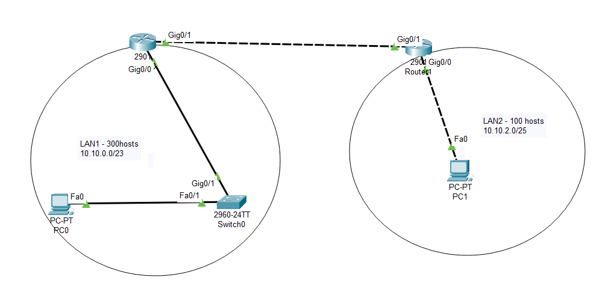
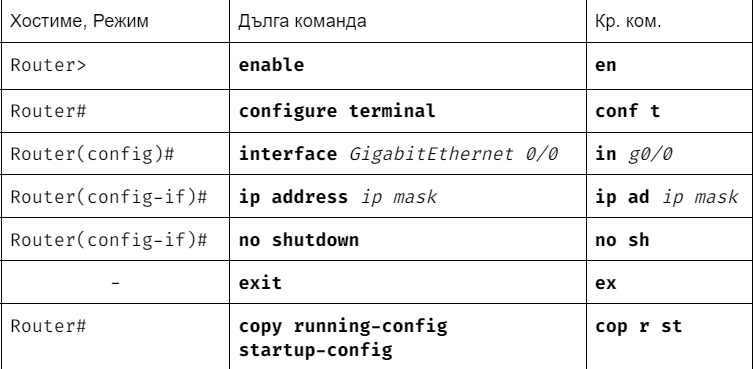

# Packet tracing - обяснено стъпка по стъпка

## Бързо и лесно. За начинаещи.

 

Това което е дадено се прекопира, като помним, че:

> кабелите между компютър-суич и суич-рутер са непрекъснати  
    кабелите между суич-суич и суич-компютър са прекъснати

>> Ако го правите за пръв път има шанс до самите кабели да не ви излизат имената на точните интерфейси. За да включите тази настройка отидете на Options -> Preferences и чекнете Always Show Port Labels In Logical Workplace.

Разпределете съответните адреси за устройствата в мрежата.

Попълваме таблицата, като гледаме описанията от страни.

> Помним, че First address е първия адрес от **хост рейнджа**

> Преписваме маската заедно с адреса

## Как се конфигурира компютър?

1. Отиваме на PC1 -> Desktop -> IP Configuration
2. На _IPv4 Address_ преписваме адреса на компютъра от горната табличка с адреси, на _Subnet mask_ разписваме маската в десетична бройна система, а на Default Getaway пишем адреса на рутера за LAN1 
    > Kато цяло гледаме дали g0/0 или g0/1 на рутера "гледа" към компютъра и така избираме кой адрес на рутера да вземем от горната таблица

## Как се конфигурират интерфейсите на маршрутизаторите?

1. Отиваме на първия рутер (с другото си име маршрутизатор) и влизаме в CLI
2. Изпълняваме долупоказаните команди по ред **два пъти**.
    
    > Първия път с интерфейс g0/0, втория с интерфейс g0/1.
    >> На **ip ad _ip mask_** се добавя IP адреса заедно с неговата маска от табличката, който отговаря на съответния интерфейс.

## Пингване на комплютър с неговия рутер.

Oтиваме на първия компютър Desktop->Command Prompt и пишем командата:

    ping (адреса на рутера в неговата мрежа)
> Пример: ping 6.9.4.2

> Внимавайте кой адрес на рутера избирате (g0/0 или g0/1)

Ако всичко работи ще изглежда подобно на това:

<c>  

    Cisco Packet Tracer PC Command Line 1.0
    C:\>ping 6.9.4.2

    Pinging 6.9.4.2 with 32 bytes of data:

    Reply from 6.9.4.2: bytes=32 time=20ms TTL=255  
    Reply from 6.9.4.2: bytes=32 time<1ms TTL=255  
    Reply from 6.9.4.2: bytes=32 time<1ms TTL=255  
    Reply from 6.9.4.2: bytes=32 time<1ms TTL=255  

    Ping statistics for 6.9.4.2:
        Packets: Sent = 4, Received = 4, Lost = 0 (0% loss),
    Approximate round trip times in milli-seconds:
        Minimum = 0ms, Maximum = 20ms, Average = 5ms

    C:\>

<c>

> Идейно е да имаме _(0% loss)_, но дори да не е толкова е все още възможно да работи, преди да се откажете винаги пингнете по няколко пъти.

## Свързване на две мрежи.

_На R1 да се конфигурира статичен път по подразбиране (който да обхваща всички възможни мрежи) и да има за Next-Hop адрес адреса на G0/1 на R2. R2 да се конфигурира път към LAN1 с Next-Hop адрес адреса на G0/1 на R1_

1. В първия рутер R1 влизаме в CLI.
2. Стигаме до режим Router(config)# и изпълняваме командата:

    ip route _destip destmask ip_

    > Вместо _destip_ пишем 0.0.0.0, вместо _destmask_ 0.0.0.0, а вместо _ip_ адреса на другия рутер    
    >> Внимавайте кой адрес на рутера избирате (g0/0 или g0/1)

За да проверим дали всичко е наред излизаме от конфигурационен режим и използваме командата show ip route (режим Router#). За да работи трябва да се е появил адрес с код __S*__ (като този на последния ред): 

<c>

    Gateway of last resort is 10.10.2.130 to network 0.0.0.0

        10.0.0.0/8 is variably subnetted, 4 subnets, 3 masks
    C       10.10.0.0/23 is directly connected, GigabitEthernet0/0
    L       10.10.0.1/32 is directly connected, GigabitEthernet0/0
    C       10.10.2.128/30 is directly connected, GigabitEthernet0/1
    L       10.10.2.129/32 is directly connected, GigabitEthernet0/1
    S*   0.0.0.0/0 [1/0] via 10.10.2.130
<c>

3. Отиваме на втория рутер R2 и правим същото като при R1, само че в командата:
    _destip_ - адреса на LAN1
    _destmask_ - маска на LAN1
    _ip_ - IP адреса на другия рутер R1

За да проверим дали всичко е наред излизаме от конфигурационен режим и използваме командата show ip route (режим Router#). За да работи трябва да се е появил адрес с код __S__ (като този на третия ред):

<c>

    Gateway of last resort is not set

        10.0.0.0/8 is variably subnetted, 5 subnets, 4 masks
    S       10.10.0.0/23 [1/0] via 10.10.2.129
    C       10.10.2.0/25 is directly connected, GigabitEthernet0/0
    L       10.10.2.1/32 is directly connected, GigabitEthernet0/0
    C       10.10.2.128/30 is directly connected, GigabitEthernet0/1
    L       10.10.2.130/32 is directly connected, GigabitEthernet0/1

<c>

## Тестване на свързаност между два компютъра

1. Влизаме в първия компютър и пингваме втория 
2. Влизаме във втория компютър и пингваме първия

> Ако вс е наред пинговете ще минат

## Това беше от мен за днес!! 

Кредит към [Божидар](https://github.com/bvpav), който ме научи как да ги правя тези, и написа таблицата с командите и техните съкращения!
